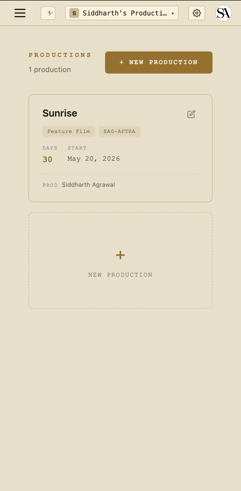

# Quickstart — Crew / Cast

You're a **T3 role**. Grace has a lot of features, but for you, most of them are irrelevant — your view is intentionally minimal. You see what you need to do your day; you don't see the budget, the contracts, or the data on your peers.

## What you see

Open `/dashboard/production` for the show you're on.

- **Day Header (compact)** — what shoot day it is and the date.
- **Your Call Today** — your call time (with override vs general-call distinction), today's location, today's scenes you appear in (cast) or any scenes scheduled (crew).
- **Today's Scenes** — same scene list, with strip color + page count + location.

That's the whole page for you. There's no sidebar full of features hidden under your fingers — by design, you don't need them.

## Cast variants

If you're cast (actor, minor, cast guardian), the "Today's Scenes" list is filtered to scenes you actually appear in based on the breakdown. If you don't see a scene listed, you're not on call for it.

## Mobile

The per-production dashboard is the main page you'll visit. Mobile-friendly — the cards stack to a single column.

## Email reminders

The call sheet is emailed to you the day before via a Grace-branded email at `callsheet@theobeliskstudio.com`. Clicking the link in the email opens a per-recipient share page that doesn't require sign-in — you can show it on your phone at the gate.

## What you can do

- View your call info
- View today's scenes
- View any scene's basic details (location, time-of-day, page count)

## What you can't do

- See other crew members' rates / contact info
- Edit the call sheet, schedule, or budget
- Submit timecards (the AD does that for you)
- Access the vault

If you need something you don't see, ping the AD or your department head.

## Next reads

- [The dot system](../concepts.md#the-dot-system) — blue = Grace, gold = human, green = signed document.
