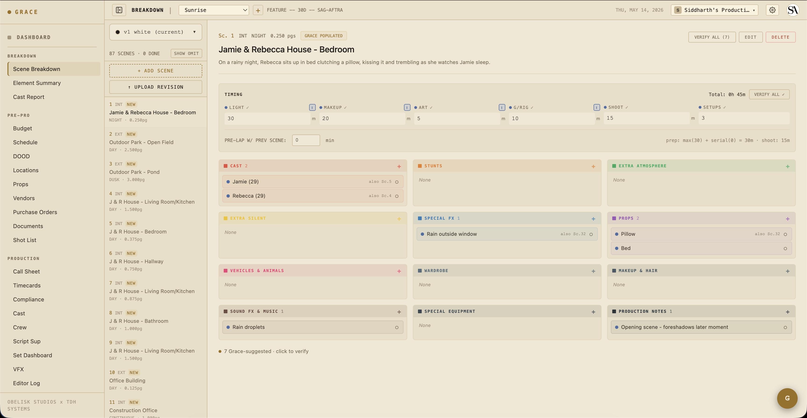

# Quickstart — Director

You're a **T2 role** — full access to scenes, shots, schedule, and the script supervisor's view. Continuity notes are visible. Budget is hidden by default (producers can override).

Grace doesn't replace your creative judgment or your storyboarding workflow. What it does is keep all your prep references in one place that the rest of the crew can see too — so when you decide on a frame, the DP and 1st AC don't have to chase you for the reference.

## Day one

1. Read [the breakdown](../workflows/02-script-to-breakdown.md). Grace has parsed your script into scenes and elements (cast, props, stunts, etc.) — review the parse and accept/reject the AI's calls. This is your master list for the show.
2. Build your shot list. Pre-Pro → Shot List. Per-scene shot rows with size, angle, lens, movement, description. The DP works from this same list.
3. Capture creative refs. Production → Creative. Drop in mood boards, frame references, prevs. Tag by scene so they show up on the relevant pages.

## What you do day-to-day

On a shoot day, you spend more time on set than on Grace. When you are in Grace, the per-production dashboard surfaces:

- **Today's scenes** — what you're shooting, page count, location, time of day.
- **Shot list progress** — total shots planned vs takes captured. Circled-take count too.
- **Set Dashboard summary** — live status of where you are in the day.
- **Continuity notes** — what Script Sup has captured since the last setup.

## Picking takes

After each scene wraps, head to Production → Script Sup or Production → Editor Log to mark circled takes and rank director picks. Picks flow through to the editor log exports (EDL / FCPXML / CSV) that go to the editor at wrap.

See [Script supervisor](../workflows/07-script-supervisor.md) for the continuity + take workflow.

## What you can write to

- Scenes (full edit — descriptions, elements)
- Shots (full edit — your shot list)
- Schedule (read — UPM owns this)
- Continuity notes (full)
- Editor log picks (full)

What you can't:

- Budget / rates (hidden by default)
- Call sheets (read only — AD owns these)
- Crew / cast contact info (read only)
- Vault (Studio-tier, gated)

## Next reads

- [Script → Breakdown](../workflows/02-script-to-breakdown.md) — review the parse, commit revisions.
- [Script supervisor workflow](../workflows/07-script-supervisor.md) — continuity, takes, picks.
- [Editor log](../workflows/09-editor-log.md) — what gets handed to the editor at wrap.
