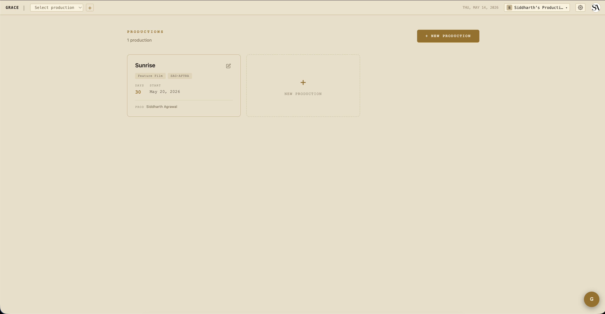
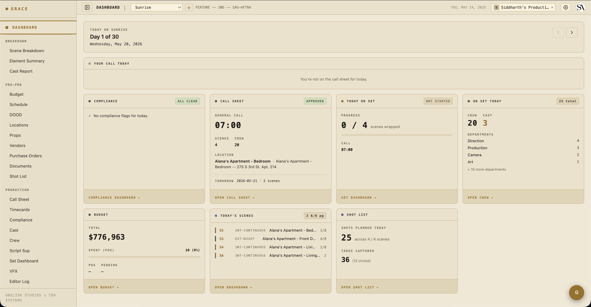

# Quickstart — Producer / Org Owner

You created the Grace organization (or were named the owner). The credit card on file is yours, billing notifications hit your inbox, and you have unconditional full access to every section of every production. There's exactly one owner per org and ownership can't be transferred.

## Day one

1. **Confirm your billing is set up.** Settings → [Billing](../reference/billing-and-seats.md) shows your plan, payment method, and seat usage. If you haven't completed Checkout, finish that first — without an active subscription, you can't get past `/dashboard`.
2. **Create your first production.** From the dashboard home, click **+ New production**. Pick a working title, shoot days, and start date. Skip the rest for now — you can fill it in later. See [Production setup](../workflows/01-production-setup.md).
3. **Invite your team.** Settings → Access → Invite. Producers, ADs, department heads first — they're the ones who'll do the day-to-day work. See [Access control](../reference/access-control.md) for what each role can do.

## What you do day-to-day

You're not in Grace every day during a shoot. The AD and UPM are. Your daily check-ins are likely:

- **Production dashboard** — open `/dashboard/production` for whichever show is active. The at-a-glance cards (compliance, call sheet status, budget snapshot, crew/cast on set, today's scenes, shot list progress) tell you the state of the production in 30 seconds. See [Dashboard cards](../reference/dashboard-cards.md) for the owner view.
- **Budget snapshot** — total committed vs spent vs pending. The card on the dashboard surfaces a percent bar; for line-item depth, drill into Pre-Pro → Budget.
- **Compliance flags** — red alerts on the dashboard mean something needs your attention or the AD's (turnaround violation, minor hours, unapproved call sheet).

## Things only you can do

- **Edit the production company name** on the production record — that's the billable identity, owner-only.
- **Delete a production** — destructive, owner-only. Members can archive (a soft read-only freeze) but only you can permanently delete.
- **Manage billing** — every billing route is owner-only. Plan switches, add-on purchases, seat-pack purchases, cancellation, payment method.
- **Delete the org** — Settings → Org → Danger Zone. Soft-delete with a typed confirmation; cancels Stripe at period-end automatically.

## When something goes wrong

- **Crew member says they can't see X**: check Settings → Access — their role tier + any overrides. Likely a T2/T3 narrowing that needs a one-key override grant.
- **Budget shows over 100%**: drill into Budget → look at the highest-actual line items. POs roll up by account automatically.
- **Production looks archived/locked when it shouldn't be**: a billing lapse triggered auto-overquota lock. Resubscribe or unarchive at Settings → Billing.

## Next reads

- [Production setup](../workflows/01-production-setup.md) — full setup walkthrough.
- [Access control & role tiers](../reference/access-control.md) — who sees what.
- [Billing & seats](../reference/billing-and-seats.md) — plans, add-ons, what happens when payments lapse.
