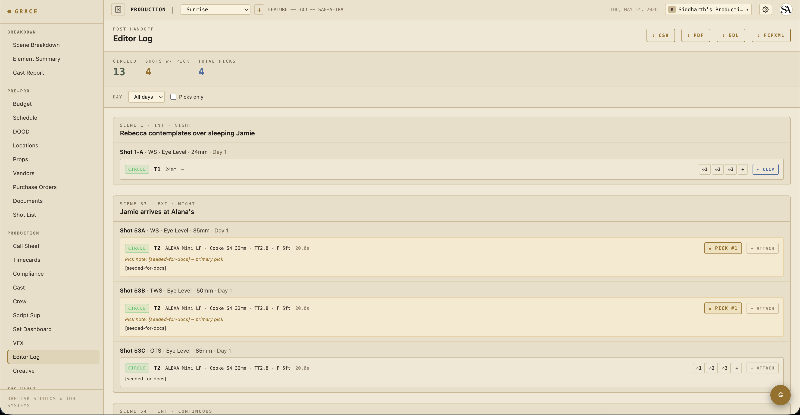

# Quickstart — Script Supervisor

You're a **T2 role** focused on continuity and takes. Scenes are hidden by default (you don't write breakdown), but the Script Sup Dashboard is full write, and shots / takes / continuity-notes are your write zone. Editor log is read-only.

## Day one

1. Open Production → Script Sup. This is your home dashboard.
2. Walk through today's scenes (left panel) → today's shots (middle) → take entry (right). The takes you log here flow through to the [editor log](../workflows/09-editor-log.md) at wrap.
3. Add continuity notes per element as you go. Tap an element on the scene side to attach a note.

## What you do day-to-day

For each take, capture:

- **Take number** — auto-increments per shot.
- **Status** — circle (the good take), hold (might use), ng (no good), false_start.
- **Camera report** — camera, camera body, lens, t-stop, filter, focus distance, duration.
- **Notes** — what was different, who muffed a line, performance notes.

After the day's coverage:

- **Continuity notes** per element — what wardrobe rolled the sleeves to, what prop position was, what makeup state. Each note carries which department captured it (HMU / Wardrobe / Set Dec / Camera).
- **Director picks** — rank takes the director called for. These show up as "selects" in the editor log.

## Continuity workflow

When you tap an element row, a drawer opens for note entry. The note ties to the (scene, element) pair, and optionally a list of shot IDs. State free-text — "blue mug, handle camera right" or "sleeves rolled to elbow, top button open."

Notes from previous scenes for the same element show in a stack so you can scan continuity history without flipping pages.

See [Script supervisor workflow](../workflows/07-script-supervisor.md) for the full continuity + take loop.

## What you can write to

- Shots (write)
- Scene takes (full — you own this)
- Continuity notes (full)
- Script Sup Dashboard (full)
- Editor Log (read)

What you can't:

- Scenes (none by default)
- Schedule (read only — UPM owns it)
- Call sheets (none)
- Crew / cast (none)

## Next reads

- [Script supervisor workflow](../workflows/07-script-supervisor.md) — continuity + takes + picks.
- [Editor log](../workflows/09-editor-log.md) — what gets handed off at wrap.
