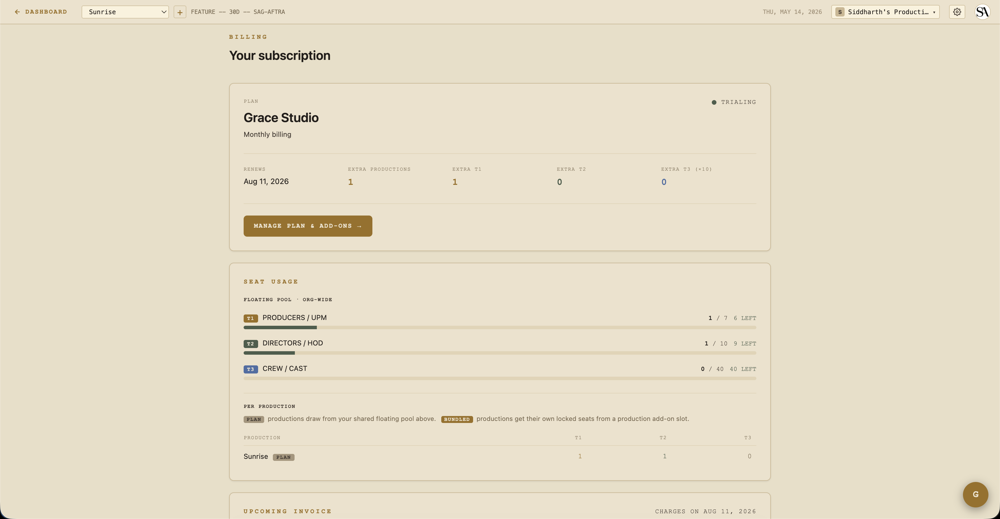

# Billing & seats

Grace's billing has three things to know:

1. **One subscription per organization**, not per production.
2. **Two plans** — Standard or Studio — with **seat-pack** and **production-slot** add-ons.
3. **Lapse, archive, and over-quota states** — automated, surfaced in banners.

## Plans

| | Standard | Studio |
|---|---|---|
| Productions included | 1 | 1 |
| T1 floating seats | 1 | 1 |
| T2 floating seats | 5 | 10 |
| T3 floating seats | 10 | 25 |
| Vault (screeners / dailies / DIT) | ❌ | ✅ |
| AI script parse | ✅ | ✅ |
| Compliance auto-generate | ✅ | ✅ |
| Price (monthly) | check `/pricing` | check `/pricing` |
| Price (annual) | ~17% discount | ~17% discount |

The Vault is the main feature gate. Without it, Standard customers see the four Vault sections in the sidebar with a STUDIO pill that opens an upgrade modal on click.

## Add-ons

Beyond the included production slot + seats, you can add:

- **Production slot pack** — +1 production slot. Comes with a **bundled-seat pool**: 1 T1 + 2 T2 + 5 T3 seats specifically scoped to that production. Use case: launching a new show.
- **T1 seat pack** — +1 floating T1 seat. Use across any production in the org.
- **T2 seat pack** — +1 floating T2 seat.
- **T3 seat pack** — +1 pack = 10 T3 seats (10× multiplier — `t3SeatAddonUnits` × 10).

Add-ons are mid-cycle subscription items. Stripe charges card on file with prorated billing.

## Seat counting

When someone is invited to a production, they consume a seat from the org's seat pool. The pool is the sum of:

- **Floating** — included with the plan + floating seat-pack add-ons. Usable on any production.
- **Bundled** — included with a production-slot add-on, tied to that specific production.

When you invite someone, Grace decides which pool they draw from: bundled first (if the production is bound to a slot and bundled capacity exists), then floating.

If a member is in the bundled pool of a production and that production gets archived, they flip to the floating pool automatically (consuming a floating seat instead).

## The over-quota state

Grace surfaces an OVER QUOTA banner when the org has more demand than capacity:

- **Tier overflow** — e.g., 4 T1 seats consumed but only 3 in the pool. Shows on a red banner with "ADD CAPACITY" + "REVIEW SEATS" buttons.
- **Bindings overflow** — more bound productions than addons paid for. E.g., 3 production slots in use but only 2 paid for. Triggers a 7-day → 30-day countdown.

## The bindings overflow countdown

When you have more bound productions than addons:

- **Day 0** — overflow detected. Banner: "Oldest bound production locks in 7 days."
- **Day 7** — auto-lock. The oldest bound production becomes read-only (members keep access but can't write). Banner: "Locked production archives in 23 days."
- **Day 30** — auto-archive. The locked production is archived; its slot frees up. Bundled members flip to the floating pool.

You can resubscribe before day 7 to clear the countdown — the lock is removed automatically when capacity catches up.

## Production state machine

Each production has two states independent of its creative status:

- **Locked** — read-only freeze. Members still consume seats. Triggered by auto-overquota (countdown) or manual owner action.
- **Archived** — read-only, members excluded from seat counting, slot freed. Triggered manually or by auto-archive after 30 days locked.

Both states are reversible — unarchive / unlock from the production card.

When unarchiving, Grace re-checks seat capacity. If unarchive would result in overflow, you get a clear error showing the exact deficit per tier.

## Lapsed billing state

Three statuses matter here, in order:

- **Active / trialing** — normal. Full access.
- **Canceled / unpaid / payment failed** — entered a 7-day grace period.
- **Lapsed past grace** — all sections org-wide drop to read-only. Owner status preserved so they can resubscribe.

The 7-day grace window is generous to handle "my card expired and I need to update it" gracefully without immediately locking the AD out mid-shoot.

Banner colors:
- **Gold (warning)** during grace — app stays writable, banner shows the grace expiry date.
- **Orange (action required)** past grace — writes blocked everywhere.
- The over-quota banner takes priority if both fire — over-quota is the more immediate issue.

## Cancellation flow

Two ways to cancel:

### Native cancel (recommended)

From Settings → Billing → **CANCEL SUBSCRIPTION**. You keep paid access through the current period. At period end, the org transitions to canceled status and enters the 7-day grace.

You can resume any time before period-end by clicking **RESUME SUBSCRIPTION**.

### Customer Portal

For more advanced changes (some advanced add-on quantity adjustments not in the native UI) the Customer Portal lives on Stripe's hosted page. Direct your customers there from Settings → Billing.

## Plan switching

Native flow at Settings → Billing → Plan. Click a plan card → confirm in the modal showing the proration preview. Changes apply with prorated billing.

Cycle switching (monthly ↔ annual) **also swaps every add-on item** to the matching cycle so you don't end up with a mixed-cycle subscription.

## Add-on purchase / removal

From Settings → Billing → **MANAGE PLAN & ADD-ONS**. Click ADD on a seat-pack or production-slot card → confirm proration in modal → done.

Removal is more nuanced because removing a production slot when bound productions exist would create overflow. The modal handles this:

1. Preview shows which productions would need to be archived.
2. Pick the productions(s) to archive via a checkbox picker.
3. Confirm — Grace archives them in one step before reducing the slot count.

## Invoice history

Settings → Billing shows the 12 most recent invoices with both a hosted-page link (lets you see retries / payment status on Stripe) and a direct PDF download.

## Owner-only writes

Every billing action is owner-only. Non-owners on a subless org pass through to whatever access they actually have (they're not gated by missing subscription — that's the owner's problem to fix). See [Access control](access-control.md).

## Test mode

Stripe is in test mode against `app.theobeliskstudio.com` (Obelisk-owned account, 6 products / 12 prices). Live-mode cutover is pending (entity-gated on LLC + EIN + business bank account). Coupons / customers / subs do NOT carry over — recreate everything in live mode when the flip happens.

## Related

- [Access control](access-control.md) — how plans/lapses clamp access matrix.
