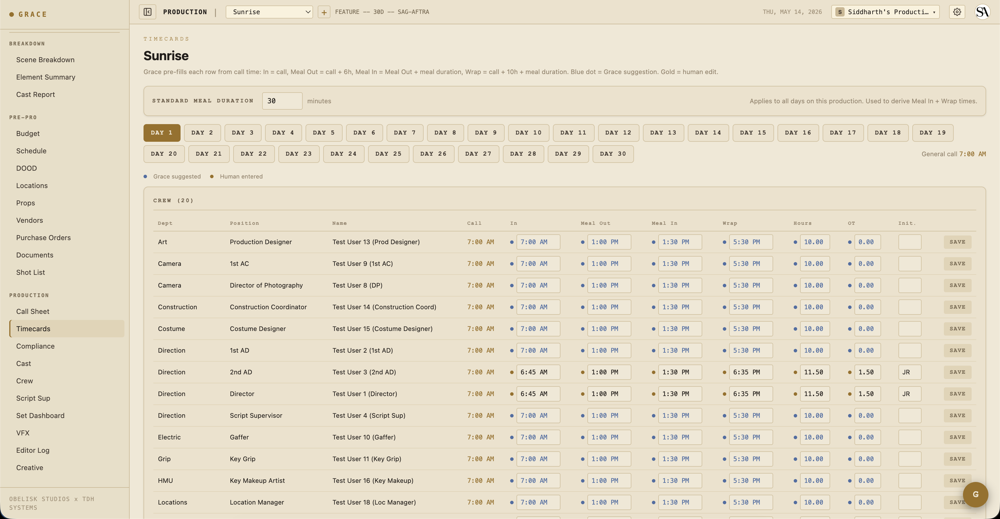

# Timecards

`Dashboard → On-Set → Timecards`. Per-day, per-crew/cast actuals. The dot system applies here heavily — the difference between Grace's prefill (blue) and a human override (gold) is the audit trail.

## The dot convention

Each cell on the timecards page has two possible states:

- **Blue dot + blue text** — Grace's prefill. Computed at read time from the call time + meal duration.
- **Gold dot + bold black text** — Human override. Whoever filled this in (1st AD, typically) typed it.

Typing into a blue field turns it gold immediately. Clearing the field reverts to Grace's blue prefill.

**Grace stores human overrides only.** The suggestions are never written; they're derived at every read. So changing a production's meal duration retroactively updates every Grace-prefilled cell across the production — only the manual overrides stay put.

## Grace prefill math

For a crew member with general call `07:00` and a 30-minute meal duration:

- **In** = call = `07:00`
- **Meal out** = call + 6h = `13:00`
- **Meal in** = meal out + meal duration = `13:30`
- **Wrap** = call + 10h + meal duration = `17:30`

For cast (the longer flow):

- **Arrived** = call − HMU mins (varies by character; default 30)
- **Makeup in** = arrived + 5 min
- **On set** = call (= shoot call)
- **Meal out** through **wrap** same as crew
- **Dismissed** = wrap + 10 min

The same math drives both the on-screen page and the printed timesheet PDFs — they can never drift.

## Hours / OT calculation

- **Total minutes** = wrap − in. Handles wrap-past-midnight by adding 24h when end < start.
- **Meal break minutes** = meal in − meal out. Same wrap handling.
- **Hours worked** = (total − meal) / 60. Decimal to 2 places.
- **OT hours** = max(0, hours − 10).

Per-union profile, the OT threshold and meal threshold vary:

- IATSE: meal at 6h, OT at 10h, OT++ at 12h
- DGA: same
- SAG: meal at 6h, OT at 8h, OT++ at 10h (more aggressive)
- Non-union: meal at 5h, OT at 10h

## Time input parsing

The input boxes accept multiple formats:

- `0710` → `07:10`
- `710` → `07:10`
- `7:10` → `07:10`
- `7:10 am` → `07:10`
- `710p` → `19:10`
- `19:10` → `19:10`

## Empty cells

If a cell is blank, Grace renders the blue prefill. If you want the cell to literally be empty (e.g., this person didn't take a meal), type a space or `-` and clear it explicitly.

## Initials column

When you fill out a row's overrides, also add your initials in the **Init** column. This is the "this row was actually checked by a human" signal that flows through to:

- The daily timesheet PDFs (initials render bold next to override times).
- The DPR (Daily Production Report) summary.

## Saving a row

There's no save button — typing into a cell saves on blur. The dot updates immediately. Network errors surface as a red border on the cell with a toast.

## Daily Crew Timesheet / Daily Cast Timesheet PDFs

Generated from the compliance page per-day per-roster. PDFs mirror the page UI:

- **Bold monospace** for human overrides.
- **Italic grey** for Grace prefills.
- Initials column populated where overrides exist.

The same Grace math runs on the PDF side, so the printed timesheet always matches what's on screen.

## Meal penalties

When the meal timer on the Set Dashboard's compliance footer crosses the union threshold (6h on IATSE), Grace automatically:

1. Computes penalty minutes (= minutes past threshold).
2. Counts penalty units (1 per 30 min past threshold).
3. Logs a budget item to the meal-penalty line for that day (auto-creates if missing).
4. Updates the budget actuals.

So a meal penalty isn't a manual entry on the timecard — it's tracked separately as a budget cascade. The Daily Crew Timesheet PDF includes a footer note when penalties were accrued for that day.

## Forced calls + turnaround

When a call sheet is approved with a turnaround violation against the previous day's wrap, Grace automatically generates a Forced Call memo PDF and attaches it as a document. The crew affected (anyone scheduled both days) is listed.

The forced call memo doesn't replace the timecard — it's a separate document for compliance audit. The timecard still records the actual hours worked.

## Who can see / edit timecards

The 1st AD (and anyone else with Call Sheets write access) can fill in timecards. Anyone with Call Sheets read access can view them.

T3 crew/cast don't see the timecards page at all — that section is hidden for them by default.

## Related

- [Compliance](../workflows/06-compliance.md) — turnaround / meal / OT / minor hours / French hours.
- [The dot system](../concepts.md#the-dot-system) — blue / gold / green colors.
