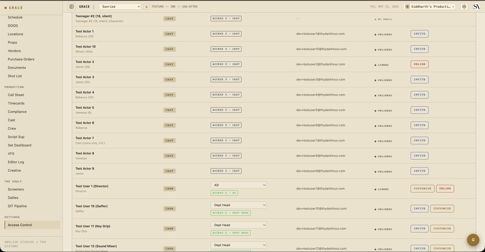

# Production setup

This is what you do once, at the start of a new production: spin up the Grace organization, create the production record, invite the team. If you've inherited a production that's already in Grace, you can probably skip this entire page — just confirm at [Settings → Access](../reference/access-control.md) that you're on the roster.

## 1. Create the organization

Skip this if your producer already created one for the company.

When you sign up for Grace at `app.theobeliskstudio.com`, the onboarding flow at `/welcome` walks you through three steps:

1. **Profile** — your first name + last name (Clerk's headless sign-up doesn't collect names; Grace asks here).
2. **Org** — your production company / studio name + slug. The slug determines the URL identifier, used by internal references; the company name shows on call sheets.
3. **Subscription** — pick a plan (Standard or Studio) and complete Stripe checkout. Beta-code users get a 90-day free trial; otherwise the card on file is charged at end of period.

Once you finish, you're the **org owner**. Ownership is permanent — there's no transfer flow because each Grace org is its own Stripe-billable entity. If you ever need a new owner, that means a new org.

> **One org per owner.** You can own exactly one Grace organization. You can be a member of multiple (invited via the invite link → accept) but you can only create one.

## 2. Create the production

From the dashboard home (`/dashboard`), click **+ New production**.

Fields:

- **Working title** — what you'll call the production internally. Can be different from the final film title.
- **Format** — feature / short / TV series / mini-series / pilot / commercial / documentary / music video.
- **Shoot days** — total scheduled days. Determines the schedule's day count + DOOD width.
- **Shoot start date** — calendar date of day 1. Subsequent days default to the next calendar day, including weekends. If your production has dark days (e.g., shooting Mon–Fri only), set the date for any affected day from the Schedule page or the Call Sheet — those edits sync everywhere.
- **Union status** — sag_aftra / iatse / non_union / mixed / tbd. Drives compliance profile (turnaround, meal, OT thresholds).
- **Production size** — Low Budget / Ultra Low Budget / Short Project Agreement / etc. Surfaces SAG-specific compliance variants.
- **Production company** — the production company that shows on call sheets. By default it's the org name; owner can override per-production.

You can leave the script + budget + schedule empty for now. They'll get filled in next.

## 3. Invite the team

From the production dashboard, navigate to **Settings → Access**.

Inviting someone is a two-step:

1. Create a crew (or cast) row with their name, email, and intended Grace role (Producer, AD, DP, Script Sup, etc.). The role determines what they'll see when they accept.
2. Click **INVITE**. Grace sends them an email from `invites@theobeliskstudio.com` with a magic link that's good for 14 days. Clicking the link takes them to the invite landing page, where they sign up (or sign in) and accept.

On accept:
- Their crew/cast row binds to their account.
- They're granted access to this production with the role + any overrides you set.
- They're added to your organization, so they show up in the org switcher.
- Their access is immediate.

If their email already matches an existing Clerk user in your org, the invite is **automatically accepted (re-linked)** without sending email — the crew row binds immediately and they get an in-app banner.

### Who to invite first

Recommended order:

1. **UPM** — they take over budget + schedule.
2. **1st AD** — they take over call sheets + set dashboard.
3. **Director + DP** — pre-pro planning starts.
4. **Department heads + crew** — usually a week before shoot.
5. **Cast** — closer to their first day, sometimes via their agent's email then re-routed.

Each invite consumes a seat from your floating pool (T1 from T1 seats, T2 from T2 seats, T3 from T3 seats). If you're out of seats, [buy a seat-pack add-on](../reference/billing-and-seats.md).

## 4. Self-join as Producer (owner only)

When you create a production as the owner, you have **read-only** access by default. To get full T1 producer access on a production, you need to self-join it: Settings → Access → **CLAIM PRODUCER SEAT** (only visible if you're the owner and not yet on this production's roster).

Self-join consumes a floating T1 seat. If your plan has 1 floating T1 seat and you're on another production already, you'll see a 409 prompt to buy more. The fix is either: leave the other production (Settings → Access → release-seat), or buy a T1 seat-pack from billing.

This is by design — even though you own the org, every production you actively work on consumes a paid seat. It keeps billing honest across multi-show orgs.

## What happens next

With the production created and the team invited, you're ready for the next workflow:

- [Script → Breakdown](02-script-to-breakdown.md) — upload your screenplay, review the AI parse.

Or skip ahead if you don't have a script yet and want to set up budget / schedule manually:

- [Pre-production](03-pre-production.md) — schedule, budget, locations, props, shot list.
