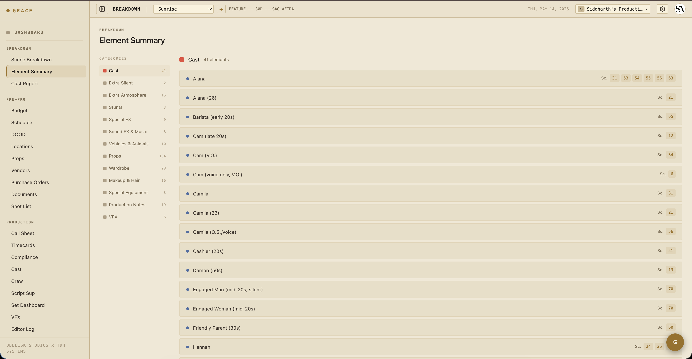
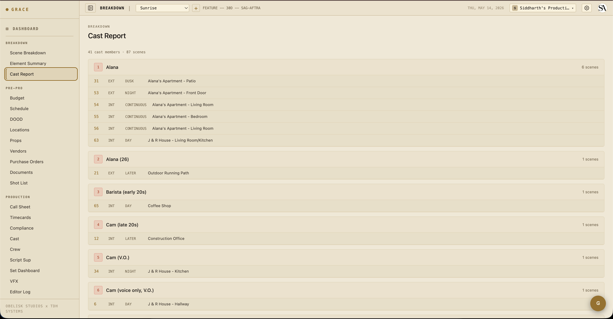

# Script → Breakdown

You have a screenplay PDF or text. Grace parses it into scenes + elements (cast, props, stunts, sfx, animals, etc.) using Claude Opus, with Gemini 2.5 Flash as a fallback. You then review the AI's calls — accept, reject, or adjust — and commit the result. The committed breakdown is the data foundation for everything downstream (schedule, budget, call sheets, shot list).

## 1. Upload the script

Open the production's **Breakdown** page (`/dashboard/breakdown`). On a brand-new production with no script uploaded yet, you'll see an upload prompt.

Click **UPLOAD SCRIPT**. Pick a PDF or `.txt` file (`.fountain` is parsed as text). Up to 25 MB.

The upload returns immediately with a `jobId` — the actual AI parse runs in the background. You'll see a **SCRIPT PARSING…** pill in the top bar with live progress (0% → 90% during the LLM stream, 90% → 100% during DB writes).

The pill is also visible on every other page of the app, so you can keep working while it runs. Typical parse time: 90 seconds to 4 minutes for a feature-length script.

> **What's actually happening**: Grace streams the script through Claude Opus 4.7 (128K output cap, primary) with prompts that ask Claude to produce scene-level structured output: scene number, INT/EXT, time of day, location name, page count, shoot minutes estimate, synopsis, and elements (cast/props/etc. with category). Gemini 2.5 Flash is the fallback on 5xx / 429 / overflow. Both models can handle a full screenplay in one pass.

## 2. First-upload flow

If this is the production's first script upload, the parse populates the database directly — scenes, elements, schedule strips (one per scene, ordered by script order), default budget (LA IATSE 2025-2026 rates), and a v1 shot list version. You skip the review step.

The scenes table is now populated. Click any scene number to drill into the scene detail panel — see all its elements, edit descriptions, mark hazardous elements as verified.

The **Element Summary** view (`/breakdown/summary`) aggregates elements across all scenes, grouped by category. Useful for "how many distinct props will we need" / "which scenes have stunts."

The **Cast Report** view (`/breakdown/cast`) shows the cast roster with their work days computed from the scenes they're in. This becomes the basis for the DOOD (Day Out of Days) on the schedule side.

## 3. Revision upload flow

Once you have a script committed, future uploads are *revisions*. The new script goes through the AI parse and is staged as `pending_review`. Grace diffs the new scenes against the existing ones:

- **Unchanged** — same scene number, content fingerprint matches. No action needed.
- **Modified** — same scene number, content changed. Diff shown side-by-side.
- **Added** — new scene number. Marked for accept.
- **Removed** — was in v1, missing from v2. Marked for soft-delete.
- **Possible match** — heading similarity ≥ 0.75 (Jaccard) suggests these are the "same" scene renamed.

You walk through the diff at `/breakdown/review/<scriptId>` and accept/reject each change. The bottom of the page has fork toggles — when you commit, Grace can also fork the schedule, budget, and shot list to new artifact versions tied to this revision (so v2 changes don't trash your v1 schedule).

### Industry revision colors

Each successive revision gets a color from the industry-standard cycle:

> white → blue → pink → yellow → green → goldenrod → buff → salmon → cherry → tan → ivory

After ivory, the prefix becomes "Double" → "Triple" etc. The revision color appears in the script header, on call sheets, and in the schedule strip footer so everyone on set knows which version you're shooting from. See [revisions](../reference/revisions.md) for the full mechanics.

## 4. Element verification

By default, every element Grace extracted shows up with a **blue dot** (Grace suggested). The first time you (or anyone with scenes write access) touches it, the dot flips to **gold** — confirmed by a human.

Why this matters:
- Producers reviewing the breakdown can see at a glance which elements have been double-checked.
- Stunt / weapon / animal elements (hazards) should always be reviewed before they appear on a call sheet — Grace can over-flag or miss things.
- Compliance: the safety bulletin on the set dashboard surfaces hazard elements from today's scenes. If a stunt element is flagged blue but not verified, that's a "needs your eyes" signal.

## 5. Commit a revision

On the review page, after toggling accept/reject per scene:

1. (Optional) Pick which artifact versions to fork (schedule / budget / shot list) and give the fork a name like "v2 — color pages 2026-05-15."
2. Click **COMMIT REVISION**.

What Grace does atomically in one transaction:
- Applies all accepted MODIFIED scenes — merges elements by `(category, lowercase(trim(name)))` so existing `castMemberId`, `isVerified`, `description` etc. survive. Updates matched, inserts new, soft-deletes orphan.
- Applies all accepted ADDED scenes — stamps `breakdownNumber = max+1..` (atomic probe).
- Applies all accepted REMOVED scenes — soft-deletes with `omittedInScriptId`. They stay visible in the UI with strike-through.
- Forks selected artifact versions (clone strips/budget/shots into new version IDs tied to the new script).
- Flips the new script's `isCurrent = true`, clears `diffPayload`, calls `snapshotScenesForScript()`.

All-or-nothing. If anything fails, nothing changes.

## 6. Discard a draft

If a revision looks wrong (the parse hallucinated too much, you want to re-upload), click **DISCARD** on the review page. The pending script row deletes; no changes propagated.

## What's next

Now that you have a breakdown, the next step is layered planning:

- [Pre-production](03-pre-production.md) — schedule, budget, locations, props, shot list, documents.
- For directors specifically: [Script supervisor workflow](07-script-supervisor.md) covers continuity + takes.
