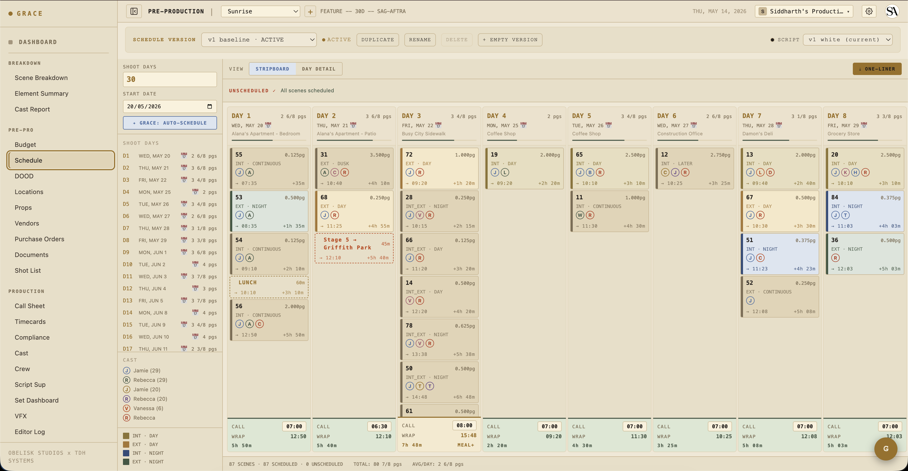
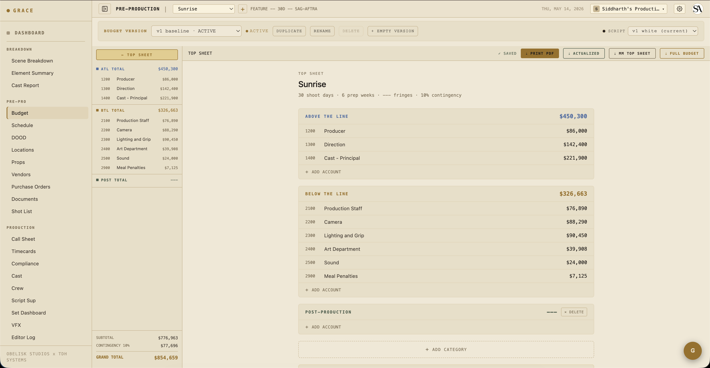
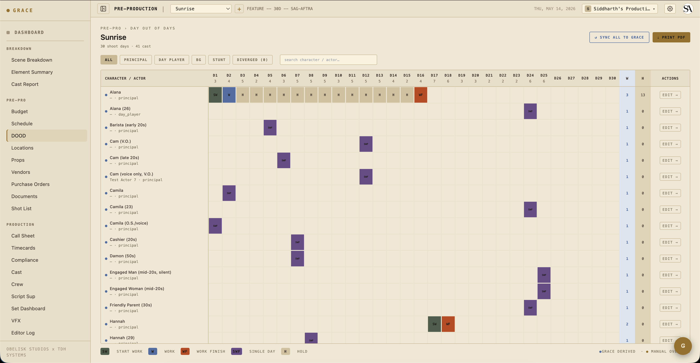
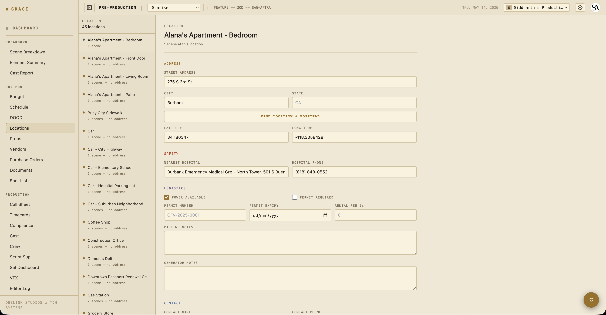
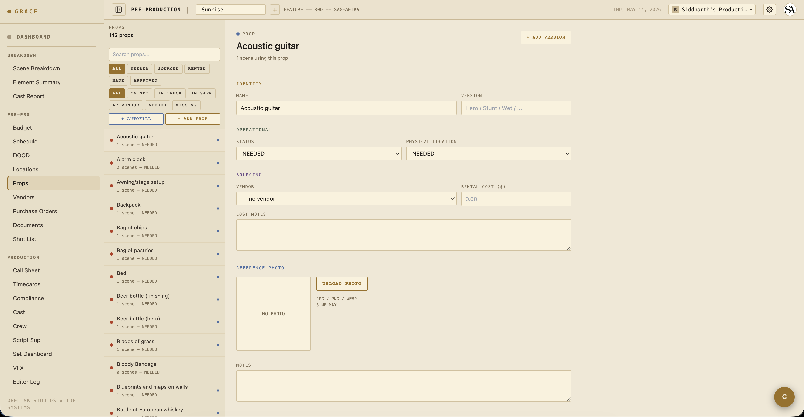
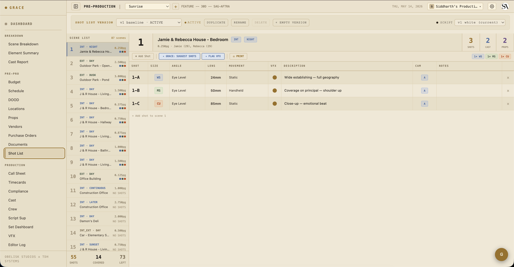
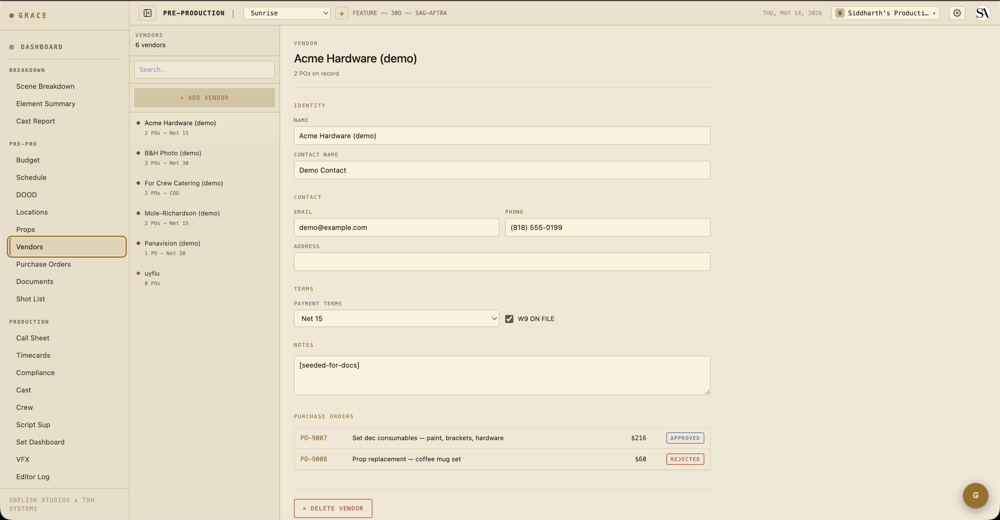
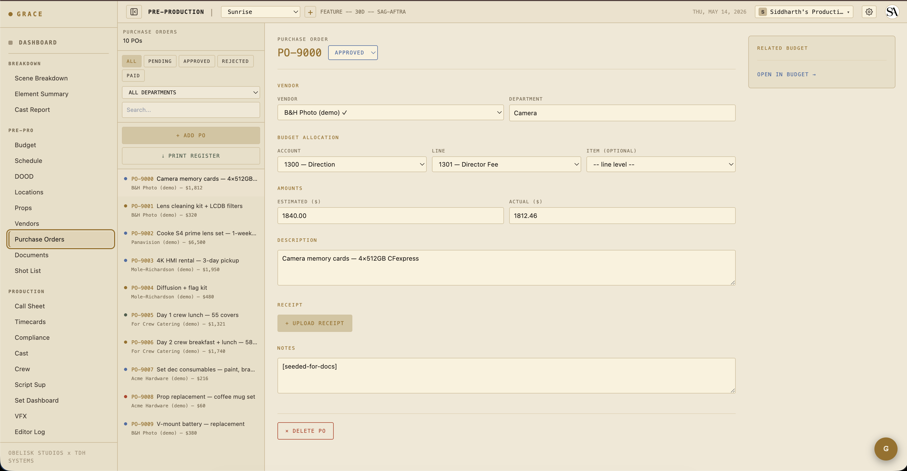
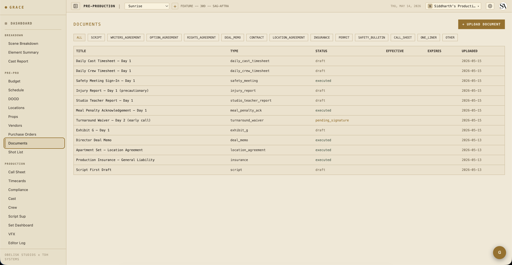

# Pre-production

Once your breakdown is committed, pre-production is everything you do before the first shoot day: lock the schedule, build the budget, scout and capture locations, gather props, plan shots, log every document. This page walks each module top-to-bottom.

## Schedule

`/dashboard/pre-pro/schedule`. The strip-based shooting schedule.

Grace creates strips automatically when you commit the breakdown — one strip per scene, in script order. From here you drag strips between days, add lunch strips, add company-move strips, add second-unit / stunt-rehearsal / travel rows.

Each strip carries:

- **Strip type** — scene / lunch / second_meal / company_move / day_start / second_unit / stunt_rehearsal / travel / custom.
- **Scene reference** — for scene strips, the FK to the scene.
- **Duration** — minutes. Auto-computed from `pageCount × pace`, override-able.
- **Color** — INT-DAY / EXT-DAY / INT-NIGHT / EXT-NIGHT for scene strips; user-set for non-scene.
- **Notes** — free-form, surfaces on call sheets.

### Day clock

Each day's wrap time is computed from `generalCall + sum(strip durations + prep/move overlap)`. The total includes per-scene prep (lighting / makeup / art-dept / grips-rigging), which is what makes the wrap time honest. Pre-2.5 versions counted shoot-only and under-estimated mornings; current code includes prep + shoot per scene strip.

### Versioning

Behind the scenes, the schedule lives in a `schedule_versions` row. Every production gets a v1 at script commit time. If you fork the schedule on a revision commit (or via the artifact version bar on the page), you create v2 / v3 / etc. — useful for "what if we shoot the diner scene before the gas station scene" what-if planning. Only one version is active per production at a time.

## Budget

`/dashboard/pre-pro/budget`.

The default budget is LA IATSE 2025-2026 rates, populated automatically when a script is committed. The structure is four levels:

> category → account → line → item

Items hold the actual numbers (units, rate, fringe percent). Lines group items. Accounts group lines. Categories group accounts.

### Per-item flags

Each item is either `grace` (cascades automatically) or `manual` (locked from Grace cascades):

- A `grace` item with rate `$2,500` per day on a 30-day shoot updates automatically when `shootDays` changes.
- A `manual` item never re-cascades — what you typed is what stays.

The cast-units cascade is one of the most useful: items linked to a cast member's `workDays` count automatically. If you adjust a cast member's work days, the budget line follows.

### Versioning

Same artifact-version pattern as schedule. Each production has a budget version. Fork on revision commit for "let's see what cutting day 18 would do to total."

### Actuals

POs roll up to budget actuals automatically. The Budget Snapshot card on the per-production dashboard shows total committed (PO sum) vs total budget. Hover the percent bar for breakdown.

## DOOD (Day Out of Days)

`/dashboard/pre-pro/dood`.

Cast-by-day grid. Each row is a cast member; each column is a shoot day. Cells show "W" (work), "T" (travel), "H" (hold) or blank (off). Computed from `cast.workDays` and the schedule.

Useful for confirming nobody is scheduled when they shouldn't be (e.g., a minor exceeding daily-hours, an actor with a hold day in their contract).

## Locations

`/dashboard/pre-pro/locations`.

One row per location. Address, geocoded lat/lon (Nominatim, browser-side to avoid rate limiting), nearest hospital (auto-resolved from a "emergency room hospital near {lat,lon}" Google Maps Text Search + blacklist filter), permit info, parking notes, power availability, generator notes, rental fee.

The lat/lon drives the WeatherStrip on the Set Dashboard. The hospital fallback drives the SafetyBulletin emergency contacts strip.

### Auto-resolution

When you type an address and tab out, Grace geocodes via Nominatim (free OpenStreetMap service). The result populates lat/lon and resolves the nearest hospital using a name-blacklist filter to skip nursing homes / hospices / urgent-care clinics in favor of an actual emergency room.

## Props

`/dashboard/pre-pro/props`.

Master inventory of physical props (or prop variants — Hero / Breakaway / Wet / Stunt). Linked to scene elements via case-insensitive name match (no FK — props can be renamed without breaking scene links).

Each prop tracks:
- **Name + version type** — "Coffee mug" + "Hero" / "Breakaway" / "Wet" etc.
- **Physical status** — needed / sourced / rented / made / approved.
- **Physical location** — needed / truck / set / safe / vendor / missing.
- **Vendor + rental cost** — linked to the vendors master.
- **Photo** — uploaded reference.

## Shot list

`/dashboard/pre-pro/shot-list`.

Per-scene shot rows. Each shot has:
- **Shot number** — 1, 2, 3 within the scene.
- **Size** — XCU / CU / MCU / MS / MWS / WS etc.
- **Angle** — eye level / high / low / over-shoulder etc.
- **Lens** — focal length.
- **Movement** — static / pan / tilt / dolly / handheld / steadicam etc.
- **Camera** — A / B / C.
- **Description** — free text.

VFX shots get an additional `vfx_shot_requirements` row attached (clean plate, tracking, HDRI, etc.). See [VFX flagging + turnover](08-vfx.md).

Director and DP share this list. Once you start shooting, takes get logged against shots (Script Sup workflow).

## Vendors + Purchase Orders

`/dashboard/pre-pro/vendors` and `/dashboard/pre-pro/purchase-orders`.

**Vendors** is the master list — name, contact, payment terms, W-9 status. Used by both props (rental vendor) and POs (vendor for an estimate / receipt).

**POs** are the actual budget commitments. Each PO ties to (account, line, item?) — usually item-specific for clarity. Status cycles `pending` → `approved` → `paid` (or `rejected`). Estimated amount + actual amount + receipt PDF upload.

POs roll up to budget actuals via `computeBudgetActuals()` — see [the Budget Snapshot dashboard card](../reference/dashboard-cards.md).

## Documents

`/dashboard/pre-pro/documents`.

Catch-all for production paperwork: deal memos, location agreements, insurance certs, permits, the script PDF itself, and the 8 [compliance documents](../reference/compliance-docs.md) Grace generates server-side (Exhibit G, turnaround waiver, meal penalty acknowledgment, etc.).

Status cycles: `draft` → `pending_signature` → `executed` → `expired`/`superseded`. Documents stay accessible after status changes — you can always pull an executed deal memo even after wrap.

## Creative refs

`/dashboard/production/creative` (in the sidebar this lives under **Creative Prep** alongside Shot List + Props).

Mood boards, frame references, previs, lookbooks. Per-asset tagging by scene IDs (an asset can reference multiple scenes). Per-department access: T1 gets full access, T2 gets read by default (narrowable to specific departments), T3 capped at read on their own department.

Video / image assets stream progressively so mobile Safari can preview without downloading the whole file.

## What's next

Pre-production is iterative — schedule, budget, locations, shot list will all change as you scout, do read-throughs, and lock cast. Once the schedule is firm and you're within a week of shoot start, the [1st AD takes over and starts building call sheets](04-call-sheets.md).
