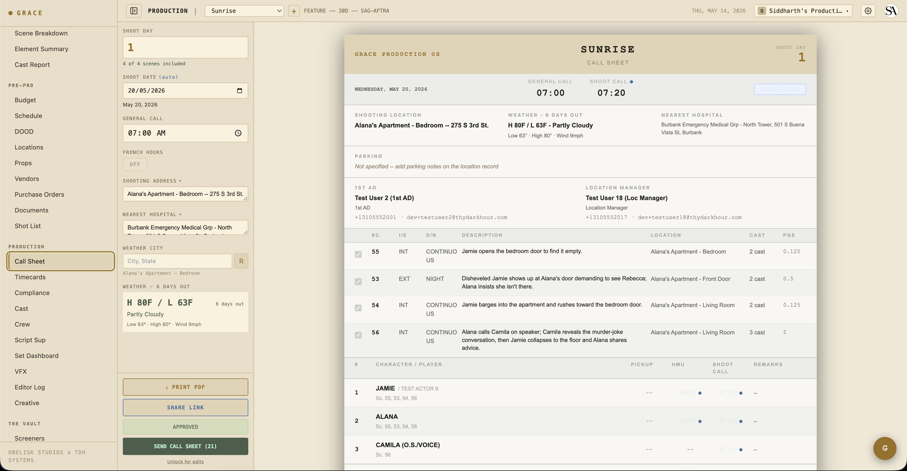
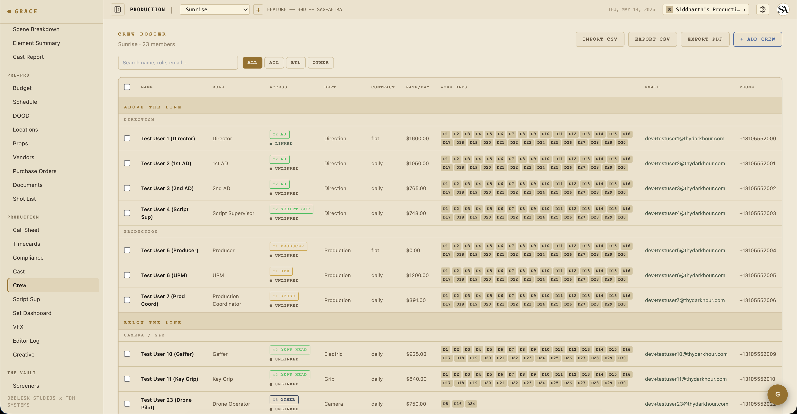
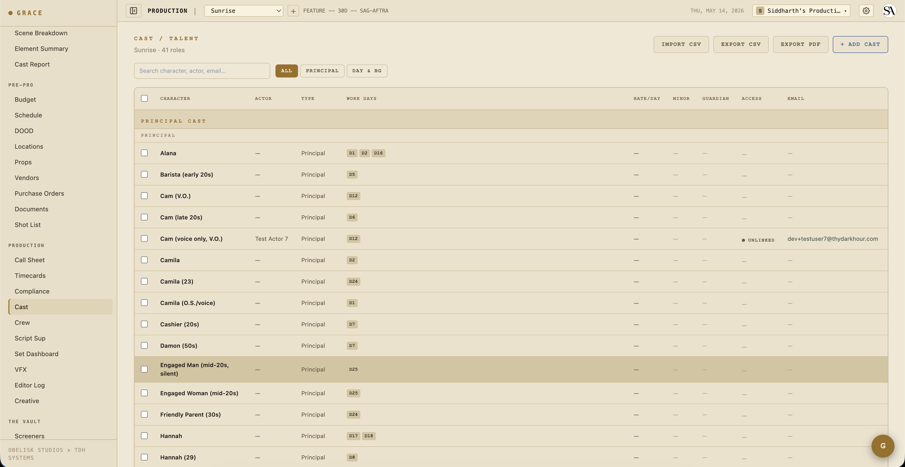

# Call sheets

The 1st AD's daily cycle. Every shoot day starts the night before — the AD assembles tomorrow's call sheet, approves it, sends to crew + cast. Grace pre-fills everything it can from the schedule + crew + cast + locations data. You spot-check, override what you need to, approve.

## 1. Open the day

Production → Call Sheet. The day-stepper at the top lets you navigate to the day you're building. Day 1 is the first shoot day from the production's `shootStartDate`.

If a call sheet doesn't exist yet for the day, Grace creates one on first open — uses today's active schedule version to bind scenes + crew + a default 07:00 general call. The created row is in `draft` status.

> **Archival invariant**: once approved, a call sheet stays bound to the schedule version that was active at the time of approval — forever. You can't delete that schedule version while approved sheets reference it. This is what makes call sheet history honest across schedule revisions.

## 2. Set the general call

The general call time (default 07:00) is when crew arrives. Per-row crew call-time overrides happen separately — Grace stores these in `call_sheet_crew.callTimeOverride`. For example, the DP/1st AC arrive at 06:00 for pre-light → override their row to `06:00`. Cast in HMU chain arrive at 05:30 → override their cast rows accordingly.

Stale-column note: `crew.callTime` exists in the schema but is no longer read by any flow. Don't try to use it as the source of truth — it's the call sheet crew override that counts.

## 3. Confirm scenes and crew

Below the header, the call sheet shows:

- **Scenes** for the day — auto-populated from schedule strips. Each row has an `included` toggle (uncheck if a scene's been postponed). Reorder via drag if you want to shoot order to differ from the schedule order.
- **Crew** for the day — auto-populated from crew whose `workDays` include this shoot day. Each row has `included` + `callTimeOverride`.
- **Cast** — same logic but for `cast.workDays`.

If the breakdown changes or the schedule changes after you've built the call sheet, you can hit **REBUILD** to re-sync scenes + crew from the current data. **REBUILD is blocked once a sheet is approved** (preserves the as-sent record).

## 4. Add department notes + movement orders

**Department notes** are free-form, per-department. Camera, G&E, Sound, Wardrobe, HMU, Art, Locations, Production. Notes flow into the dept-specific section of the printed PDF + the email.

**Movement orders** track how crew/equipment moves through the day. Grace auto-generates these from location changes across scene strips (Scene 1 → Scene 2 in a different location = a move). You can edit, mark them manual (won't auto-update on rebuild), or add custom orders.

## 5. Compliance gates on approve

Before you can approve, Grace runs server-side compliance checks:

- **Turnaround vs previous day's wrap** — if previous day wrap → current day call is less than the union profile's turnaround minimum (IATSE 12h, DGA 11h, SAG 12h, etc.), Grace flags it. You can still approve — Grace will auto-generate a Forced Call memo PDF and attach it to documents.
- **Minor hours** — for any minor cast on call today, Grace checks that their day length (earliest call → projected wrap) doesn't exceed the profile's minor cap. If it does, approve returns **422** with a list of violations. You can re-submit with `acknowledgeMinorViolations: true` to override; the override is logged with your user ID.
- **French hours** — if checked, meal penalty checks are suppressed for the day. Grace records this on the sheet.

## 6. Approve and send

Click **APPROVE**. The sheet locks (now in `approved` status). The schedule version it references becomes archivally bound — you can't delete it.

Click **SEND**. Grace generates a personalized HTML email per recipient via `buildEmailHtml`. Each crew/cast member gets a unique magic-link URL (`/s/<token>`) to view the day's sheet — no sign-in required. Token TTL: 48 hours.

The email comes from `callsheet@theobeliskstudio.com` with `From: Grace Production OS`. Replies route via `resolveReplyTo` to the 1st AD first, then the original sender, then the org owner, then `support@theobeliskstudio.com`.

## 7. Crew + cast rosters

Production → Crew and Production → Cast are where the actual roster lives.

The rosters cluster by ATL (Above-The-Line: production, direction, executive), BTL (Below-The-Line: camera, sound, grip, G&E, art, etc.), and OTHER. Sticky headers as you scroll.

From each row, you can export PDFs of the roster (camera report style or roster report) using `roster-pdf.ts` helpers — useful for printing for set or sharing with insurance.

Each row carries:
- **Work days** — list of shoot days they're scheduled. Drives DOOD + auto-include on call sheets.
- **Email + phone** — used for call sheet sends + emergency contacts.
- **Access template** — direction / production / BTS / medical / support. Gates phone visibility on call sheets: ATL contact info shows "(contact via production)" on copies sent to BTL recipients.
- **Deal memo document** — link to the executed contract.
- **Grace role + access overrides** — what they see in the app.

## When things go sideways

- **Crew member can't get the email** — check the email logs in the send response (delivery status per recipient).
- **Email link expired** — the magic-link tokens are 48hr. Re-send the call sheet to issue new tokens.
- **Recipient wants to print the sheet** — the share page has a print button that opens a print-optimized white-background version. Or attach the PDF directly via the call sheet's send settings.
- **Approve is blocked by minor hours** — either restructure the day to come under the cap, or acknowledge the violation when you re-submit.

## Next

- [Set Dashboard](05-set-dashboard.md) — the live shoot-day version of this sheet. Same data, much more clock-work.
- [Compliance](06-compliance.md) — the 8 doc types that automate around your call sheet flow.
- [Timecards](../reference/timecards.md) — capture actuals during/after the day.
