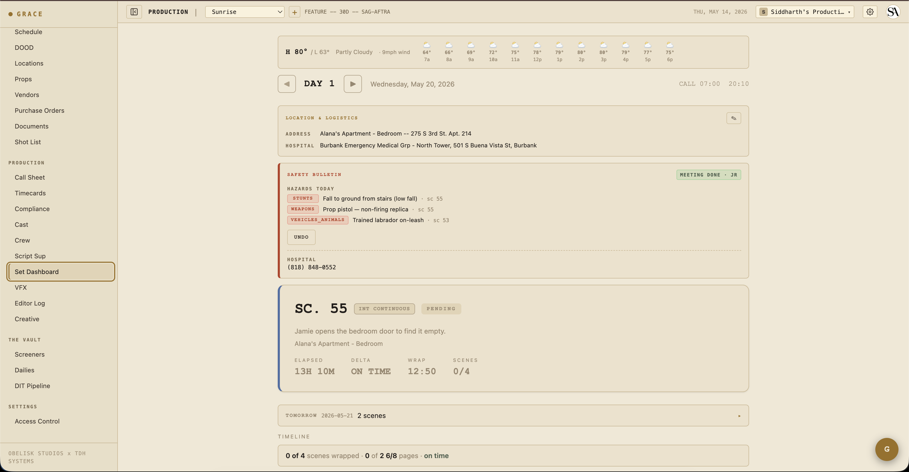
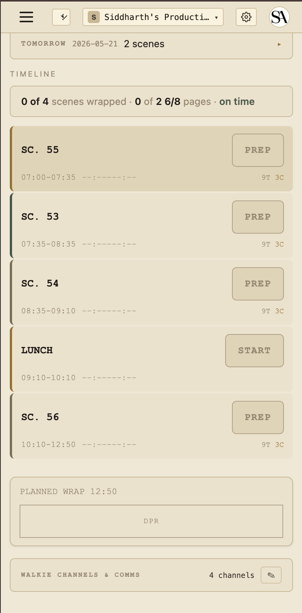

# Set Dashboard

`/dashboard/production/set`. The single page the 1st AD lives on during a shoot day, plus a handful of companion cards that make it useful to everyone else on set too.

The page is built around the **strip timeline** — your day, top to bottom, in shooting order. Each strip is a scene (or a meal, a company move, a stunt rehearsal). You mark strips `prepping` → `shooting` → `wrapped` as the day goes. Grace updates the projected wrap time in real-time as you do.

## Top of the page

The companion cards above the day header surface things every department needs to know quickly:

### Weather strip

A banner with current temp + condition + wind, an hourly icon row across the shoot window, and a sunset countdown when today has EXT scenes. If precipitation crosses 40% within the shoot window and you're scheduled for EXT, you get a "RAIN AT 3PM" alert.

Driven by Open-Meteo (free, browser-side fetch). Requires the day's primary location to have lat/lon geocoded — set this at Schedule & Locations → Locations.

### Day header

Day number (DAY 1 of 30), date, current time, general call. Day-stepper navigates between days for review.

### Turnaround warning

A red banner appears if the previous day's wrap puts today's call inside the union turnaround minimum. The hours-shortfall is displayed. (A Forced Call memo PDF was auto-generated when this was first approved — see [Compliance](06-compliance.md).)

### Location & Logistics

Address, hospital, base camp, crew parking, holding area, Wi-Fi creds, catering location/time. Editable inline by `callSheets:write` roles (the AD).

### Safety Bulletin

Today's hazards (stunts / SFX / pyro / weapons / firearms / animals / water / heights / aerial elements) listed as red chips. A **MARK MEETING DONE** button captures initials + timestamp, then displays a green chip ("MEETING DONE · JR · 7:15 AM"). Emergency contacts strip below — medic / fire / police / hospital phone numbers, each a `tel:` link.

Safety meeting state is production-wide — once one AD marks it done, everyone on the production sees the same green chip with the same initials.

## Middle — the hero card

The hero card is the current scene. Big scene number, brief description, slate-style strip color border (blue INT-DAY / green EXT-DAY / etc.). When the current strip status is `prepping`, the border is gold; `shooting`, green; `wrapped` rolls forward to the next.

Below the hero is **Wrap notes** — the AD's notes that flow into the DPR (Daily Production Report).

## Tomorrow at-a-glance

A collapsible card between hero and timeline showing tomorrow's call time + scene previews, plus a peek at the day after.

## Company moves

When today's schedule has a company move or travel strip, an orange-bordered banner emphasizes it above the timeline so it doesn't get lost. Depart time + duration + destination + notes.

## Timeline

Each row is a strip. Left to right:

- **Strip color bar** — INT-DAY / EXT-DAY / INT-NIGHT / EXT-NIGHT for scene strips; meal / move / custom colors for non-scene.
- **Scene number** or strip label (LUNCH, COMPANY MOVE, STUNT REHEARSAL, etc.).
- **Description** — for scene strips, the scene synopsis.
- **Take counts** — `4T 2C` means 4 takes shot, 2 circled.
- **Delta vs planned** — `+12m` red = 12 min over planned; `-5m` green = 5 min under.
- **Status button** — PREPPING (gold) → SHOOTING (green) → WRAPPED (faded) → click to cycle.

### Progress narrative

Above the timeline, one human sentence summarizing the day:

> "4 of 6 scenes wrapped · 2 1/8 of 5 1/8 pages · running 22 min behind"

Derived from the wrap state + page counts + projected delta.

## Bottom — compliance footer

The compliance footer (gold-on-black bar at the bottom) shows live state only when you're viewing today's shoot day. Off-day previews show only `PLANNED WRAP HH:MM`.

When on today:

- **Meal timer** — minutes since call (or since last meal end). Turns gold at 5h30m, red past 6h (IATSE threshold). Once in penalty, a meal penalty automatically logs to the budget (mealpen:dayN account).
- **OT** — accumulated work minutes. Buckets: OK (under 10h), MEAL+ (over 6h), OT+ (over 10h), OT++ (over 12h). Bucket determines budget OT cascade.
- **Projected wrap** — current time + remaining strip durations + delta vs planned. Color = green (ahead), gold (slightly behind), red (significantly behind).
- **DPR button** — Generate the Daily Production Report PDF. Includes wrap time, scenes completed, page count, top notes, compliance summary.

## Walkie channels

Collapsible card at the bottom showing per-department walkie channel mapping ("CH1: production, CH2: camera+1, CH3: G&E") + a crew chat link (WhatsApp / Slack). T1/T2 can edit inline (pencil → flip → save). T3 read-only.

## Mobile

The Set Dashboard works on mobile (cards stack to single column). The desktop version is more usable on a 12-hour shoot day — most ADs run it on a laptop in video village.

## Off-day previews

When you scroll to a different shoot day via the day-stepper:
- Compliance footer goes static (`PLANNED WRAP HH:MM` only — no meal timer, no live OT)
- Strip timeline still rendered with planned times
- All other cards work as expected

This is intentional — the wall-clock vs the day's general call only makes sense when you're physically on that shoot day.

## Mobile screenshot

## Next

- [Compliance](06-compliance.md) — the 8 doc types and how they integrate with the set day.
- [Timecards](../reference/timecards.md) — capture actuals at wrap.
- [Editor log](09-editor-log.md) — circled takes flow downstream.
