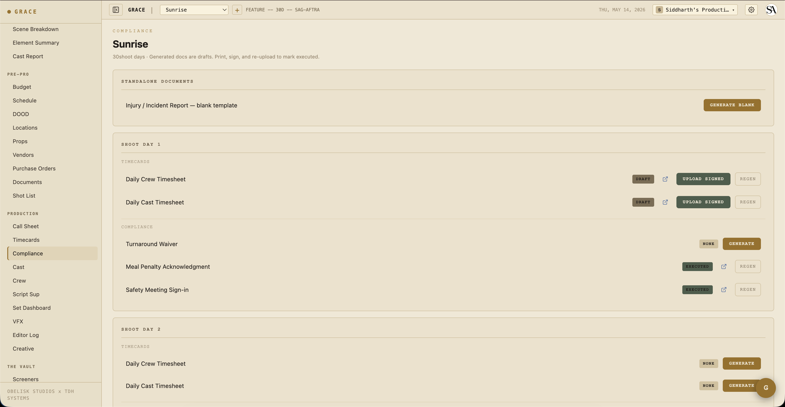

# Compliance

Production compliance is mostly automatic in Grace. The 1st AD doesn't generate PDFs by hand; the system flags violations, generates the appropriate document, and logs everything to the audit trail. Your job is to review what Grace flags and sign the docs when they need physical signatures.

## The compliance dashboard

`Dashboard → Compliance`. Shows every compliance document for the production grouped by shoot day.

Each row shows:

- **Type** — Exhibit G / turnaround waiver / etc.
- **Title** — auto-generated like "Exhibit G — Day 3."
- **Status** — Draft / Pending signature / Executed / Expired / Superseded.
- **Actions** — OPEN (view PDF) / UPLOAD SIGNED (replace draft with the executed copy).

## The eight document types

Each of these is generated by Grace automatically (or, where noted, on demand). The lifecycle is paper-first: Grace builds a draft PDF, the AD prints + collects signatures + uploads the executed copy back.

### Exhibit G

The standard Exhibit G — every working cast member's actual hours for the day. Generated automatically when a call sheet is approved and any cast were on call. Auto-pulls timecard entries for the day if available; otherwise lists planned call → wrap.

### Turnaround Waiver

Generated automatically when call sheet approve detects a turnaround violation against the previous day's wrap. The PDF lists which roles waived and the gap (e.g., "9.5h turnaround vs 12h required"). Once generated, the AD prints + collects signatures + uploads the executed copy.

### Meal Penalty Acknowledgment

Generated when the meal timer crosses the union threshold on a given day. Tracks penalty units accrued and which cast/crew were affected. The budget automatically logs the penalty cost to the meal-penalty line for that day.

### Studio Teacher Report

Required when minors are on call. Generated automatically when minor cast appear on an approved call sheet. Tracks school hours / set hours / work hours / rest periods per minor.

### Injury Report

Manually generated. From the compliance dashboard, click **+ NEW INJURY REPORT**. Fill in the incident details. (A full in-app form for richer data entry is on the roadmap.)

### Safety Meeting

Generated when the Safety Bulletin's MARK MEETING DONE button is clicked. Captures initials, timestamp, list of hazards covered, and who attended.

### Daily Crew Timesheet

Auto-generated from the timecard entries page. PDF mirrors what's on screen — actuals where present, Grace prefills in italic grey where they're not.

### Daily Cast Timesheet

Same as above but for cast (arrived → makeup-in → on-set → meal-out → meal-in → wrap → dismissed flow).

## Compliance profiles

Each production has a `unionStatus` that determines its compliance profile:

| Union status | Turnaround | First meal threshold | OT threshold |
|---|---|---|---|
| IATSE | 12 hr | 6 hr | 10 hr / 12 hr |
| DGA | 11 hr | 6 hr | 10 hr / 12 hr |
| SAG-AFTRA | 12 hr | 6 hr | 8 hr / 10 hr |
| Teamsters | 10 hr | 6 hr | 10 hr / 12 hr |
| Non-union | 10 hr | 5 hr | 10 hr / 12 hr |
| Mixed | IATSE (strictest) | IATSE | IATSE |

## French hours

When a production runs French hours for a day, meal penalty checks are suppressed for that day. Flag this on the call sheet (French hours checkbox before approve). Crew grazes continuously and no formal meal break is required.

## Minor hours

Minor cast (under 18) have stricter daily-hour caps. Grace validates each minor's day against:

- **Earliest call** — when they're scheduled to arrive (call sheet general call + HMU chain).
- **Day wrap** — projected wrap from the day clock.
- **Profile cap** — varies by age and union; e.g., 8 hours under 6, 9 hours 6-8, 10 hours 9-15, 12 hours 16-17 per CA law.

Approve is **blocked** when a minor exceeds the cap. The AD can either:

1. Restructure the day to come under the cap.
2. Acknowledge the violation and approve anyway. The override is recorded with your user ID and timestamp for audit.

## Timecards

`/dashboard/production/timecards`. Per-day, per-crew/cast entries with actual times.

Each cell shows two states:

- **Blue dot + blue text** — Grace's prefill from the day's call + meal duration. The math: in = call, meal out = call + 6h, meal in = meal out + meal duration, wrap = call + 10h + meal duration.
- **Gold dot + bold black text** — Human override. The AD typed this in.

Typing into a blue field turns it gold. Clearing a field reverts it to blue (Grace re-suggests). Grace stores only the human overrides — the suggestions are recalculated each time from the production's meal duration setting.

The PDF that ships to UPM / accountant mirrors the same convention — overrides bold monospace, Grace fallbacks italic grey.

## Workflow summary

Daily, the AD's compliance loop is:

1. Build tomorrow's call sheet → check for compliance flags.
2. If turnaround violation → either restructure or accept (Forced Call PDF auto-generates).
3. If minor hours violation → restructure or acknowledge (override logged).
4. Mark safety meeting done → captures initials.
5. Run the day on the Set Dashboard → meal timer + OT clock live.
6. After wrap → capture timecards → generate DPR.

Most documents auto-generate based on day events. The AD signs and uploads the executed copies as they come back. No manual paperwork unless something unusual happens.

## Next

- [Timecards reference](../reference/timecards.md) — the dot system + Grace prefill math.
- [Compliance documents reference](../reference/compliance-docs.md) — full per-type reference.
