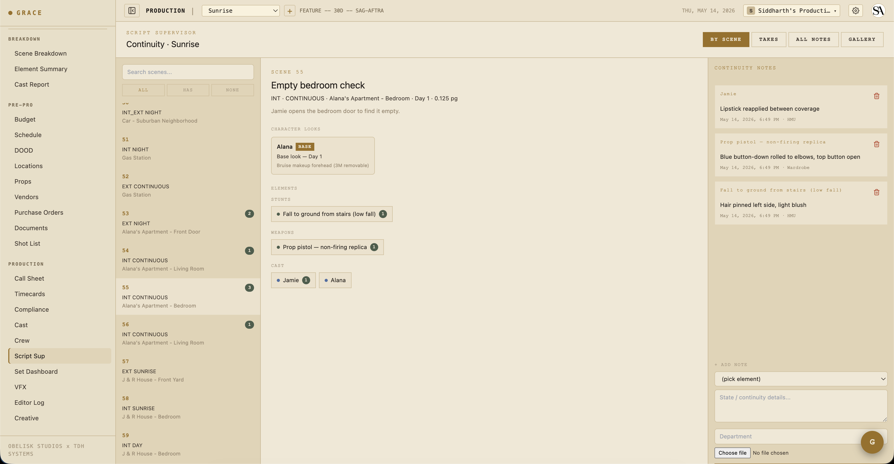
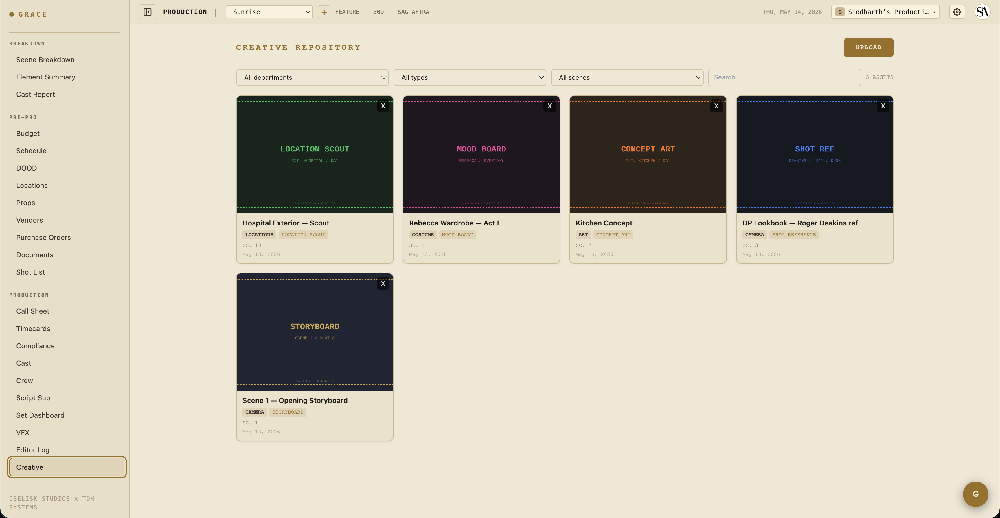

# Script supervisor workflow

`/dashboard/production/script-supervisor`. Script Sup's dedicated work surface for capturing continuity, takes, and director picks. The continuity notes + takes you log here flow downstream to the editor log + the daily camera report PDFs.

## Layout

Three panes on desktop. On mobile, you toggle between them via tabs:

- **Left — Scenes list** for today (or whichever shoot day you're on). Includes any non-scene strips (lunch, moves) for context.
- **Middle — Shots for the selected scene**. Each shot row collapses to show its takes.
- **Right — Take detail + continuity panel** for the selected shot.

## Logging a take

When a take rolls:

1. Tap the active shot.
2. Tap **+ NEW TAKE** (or the keyboard shortcut if you have one wired).
3. Set the take's `status`:
   - **Circle** (the keeper) — green dot.
   - **Hold** — might use. Default for tentative coverage.
   - **NG** — no good. Director can override later via Editor Log picks.
   - **False start** — never rolled / aborted.
4. Capture the camera report fields:
   - **Camera** — A / B / C / etc.
   - **Camera body** — model (ALEXA Mini LF, RED Komodo, etc.).
   - **Lens** — focal length.
   - **T-stop** — exposure.
   - **Filter** — ND / pol / diff / etc.
   - **Focus distance** — feet/meters.
   - **Duration** — seconds.
5. **Notes** — what was different. Whose line was muffed, whose timing was off, what the prop did that it shouldn't.

Take number auto-increments per shot. Re-numbering is intentional and locked (UNIQUE constraint on shotId + takeNumber).

## Continuity notes

When you tap an element row from the scene side, a continuity drawer opens. Drop in a state note:

- **HMU** — "Hair pinned left, light blush"
- **Wardrobe** — "Blue button-down rolled to elbow, top button open"
- **Set Dec** — "Coffee mug 3/4 full, handle camera right"
- **Camera** — "Practical lamp ON, lampshade tilted 10° clockwise"

Each note carries:
- **Element ID** — what it's about.
- **Scene ID** — where it was captured.
- **Shot IDs** — optional array of shots the note applies to (default empty = all shots in the scene).
- **State** — your freeform text.
- **Captured by dept** — which department (HMU / Wardrobe / Set Dec / Camera / Sound).
- **Captured by user ID + timestamp** — provenance.

Notes for the same element accumulate over time. When you tap that element on a future scene, you see the stack of previous notes for continuity reference — no need to flip through paper.

## Director picks

After scene coverage is done, the director may rank specific takes as "selects." From the Set Dashboard or Editor Log:

1. Find the shot.
2. From the shot's take list, tap a circled take.
3. Mark it as the primary pick (orderIndex 0) or rank it (orderIndex 1, 2, ... for secondary picks).

Picks land in the `shot_selects` table and flow through to the editor log + the EDL / FCPXML / CSV exports.

## Mobile

Script Sup uses an `mobilePane` state (`'list'`/`'detail'`/`'notes'`/`'data'`) to swap which pane is visible. The dashboard tab in TopBar (BREAKDOWN / SCHEDULE / etc.) resets `mobilePane` to `'list'` on tab change so you start from a known state.

## Creative refs

`/dashboard/production/creative` shows reference assets tagged by scene.

From the script sup detail pane, you'll see a **CREATIVE REFS** strip showing any assets tagged to the selected scene — mood boards, prevs, frame references from the director.

## What flows downstream

Everything you log here drives:

- **Editor log** — Production → Editor Log is the circled-takes view by default, with an option to show all takes.
- **Camera report PDF** — exports a daily camera report from your take data.
- **Script supervisor report PDF** — exports a continuity-focused report.
- **Editor log exports** — EDL / FCPXML / CSV / PDF — see [Editor log](09-editor-log.md).

## Next

- [Editor log](09-editor-log.md) — where your circled takes + picks show up.
- [VFX flagging + turnover](08-vfx.md) — if today had VFX shots, the requirements should be tracked here too.
