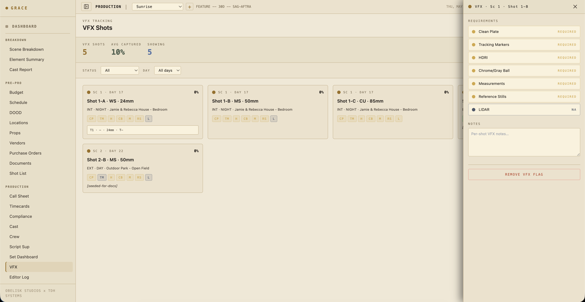

# VFX flagging + turnover

`/dashboard/production/vfx`. The VFX Supervisor's dashboard for flagging shots, tracking capture readiness, and exporting the turnover package at wrap.

## How VFX shots get flagged

Three ways a shot becomes "VFX" in Grace:

1. **Grace AI suggestion** — Grace runs a pass over your shot list looking for visual descriptions matching VFX work ("monster steps out of the closet", "muzzle flash", "green-screen plate"). Suggested shots appear with a blue dot.
2. **VFX Sup flag** — you manually tag a shot from the dashboard. Marked with a gold dot.
3. **Imported from a previs / turnover plan** — bulk upload (on the roadmap).

## Requirements per shot

Every flagged shot has 7 capture requirements with status `required` / `captured` / `na`:

- **Clean plate** — empty-frame plate of the same setup without actors. For background replacement / set extensions.
- **Tracking markers** — visible markers (tape, ping-pong balls) for 3D track.
- **HDRI** — light-probe panorama at the actor's position. For relighting in CG.
- **Chrome + gray ball** — chrome ball (specular reflection sample) + gray ball (diffuse light sample). For lighting reference.
- **Measurements** — physical set measurements / scale references. Sometimes a tape measure shot, sometimes drone-photo + plate.
- **Reference stills** — photos of the set, costumes, props from multiple angles. Used in the VFX bid + during the comp.
- **LIDAR** — 3D scan of set geometry. Often N/A for small productions; common on big-budget.

Plus a free-text notes field for shot-specific quirks.

## Status cycle

Each requirement cycles: `required` → `captured` → `na` → `required`. Click the badge to advance. The dashboard's overall capture rate (the percent bar on the dashboard) is the ratio of captured to (required + captured).

## Status colors

Borrowed from the dot system:

- 🔵 **Blue** — Grace suggested (this shot might be VFX). Visible, editable.
- 🟡 **Gold** — Human flagged or confirmed.
- 🟢 **Captured** — Requirement satisfied.
- ⚫ **N/A** — Doesn't apply (e.g., no LIDAR on a small indie).

## The flag detail panel

Tap a flagged shot to open the requirements panel. Editable inline. Below the requirements, the panel shows:

- **Linked take data** — circled take's camera report (focal length, t-stop, filter, focus distance, lens distortion grid if measured). Pulled from the Script Sup's logged takes.
- **Linked dailies clips** — once the DIT package is delivered, the clip's file name links here so the VFX team can pull the source.
- **Scene context** — INT/EXT, time of day, location, description.

## Daily workflow on set

For each flagged shot the day it shoots:

1. **Confirm the scope** — does the requirements list match what the VFX team needs? Update if the team's scope changed since pre-pro.
2. **Capture the references** — clean plate, HDRI, chrome/gray ball, etc. as the AD calls for them between takes.
3. **Tick captured** as each is done. Don't wait until end-of-day to update — it's easy to lose track.
4. **Notes** — write down anything that'll save the VFX team time: "actor's hand crosses screen-right at 4:12", "fan blowing curtain SR, possible mark", "muzzle flash captured frame 47".

## VFX turnover at wrap

At end of show, generate the **VFX Turnover PDF** from the dashboard (button top-right). Per-shot:

- Scene number + scene context
- Shot number + description + assigned camera setup
- Requirements status (captured / na / required — anything not captured will surface as TBD on the turnover doc)
- Circled take camera report
- Linked dailies clip filename (for editor → VFX team handoff)
- Per-shot notes

This PDF goes to the VFX vendor (or in-house VFX team) along with the dailies. The dailies clips themselves stream from the Vault.

## Status spread on the dashboard

The dashboard at a glance:

- **Today's VFX shots** — flagged shots scheduled today, with `required vs captured` count.
- **Production-wide queue** — Required / Captured / N/A counts across all flagged shots.
- **Capture rate bar** — green bar; 100% means everything VFX-ready.

## What you can't do here

- Reviewing/approving the actual VFX shots after delivery isn't in Grace — that's a separate pipeline (Frame.io, ftrack, ShotGrid).
- Lens distortion grid capture has a dedicated workflow in some productions but isn't templated in Grace yet.
- On-set previs viewer (loading a PV sequence inline with the shot) is on the roadmap.

## Next

- [Editor log](09-editor-log.md) — circled takes show up here too, separately from the VFX queue.
