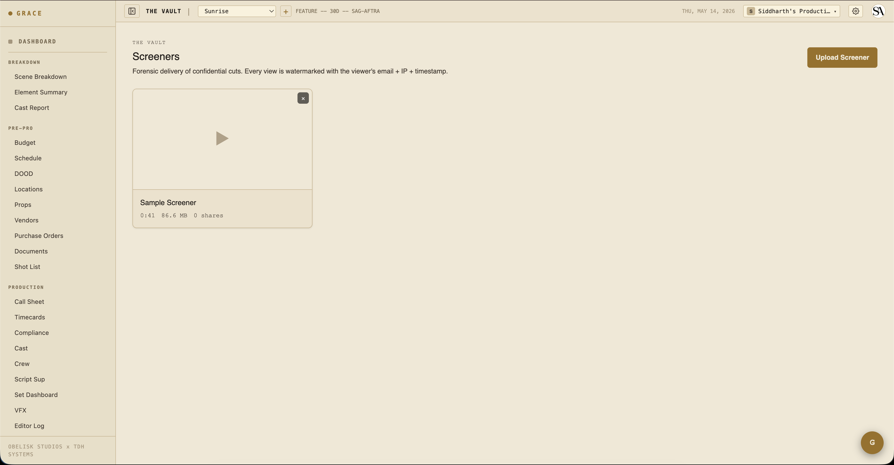
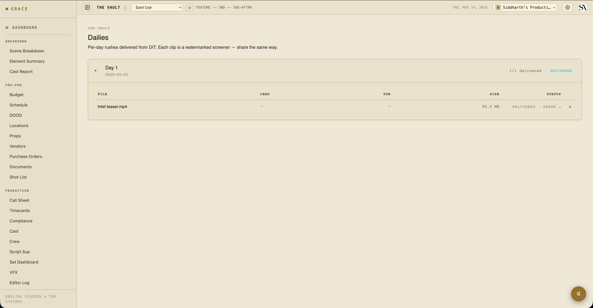
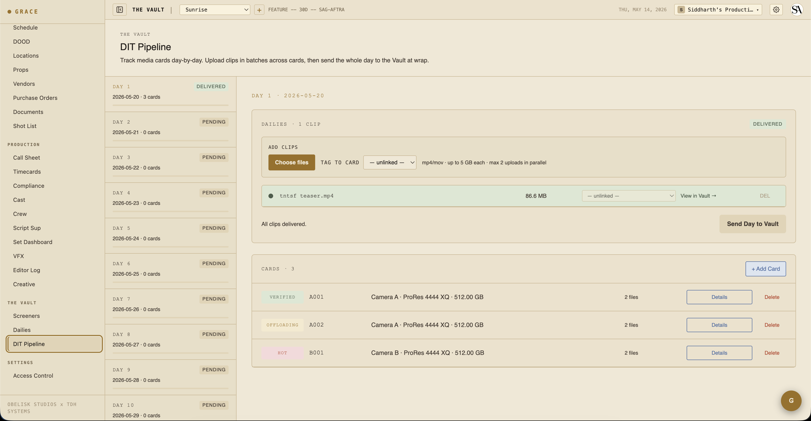

# Vault — screeners, dailies, DIT pipeline

The Vault is Grace's secure media delivery surface. Three sub-modules:

- **Screeners** — magic-link delivery of cuts / assemblies / pitch reels to producers, financiers, festivals.
- **Dailies** — per-day raw camera captures delivered to the editor + post team.
- **DIT pipeline** — set-side media card tracking + offload management.

All three require **Studio plan** (the Vault sections are gated to Studio-only orgs; Standard orgs see them with a STUDIO pill that opens an upgrade modal on click).

## Screeners

`/dashboard/vault/screeners`.

A screener is a cut you want a specific person (producer / financier / festival) to be able to view, but not download. Each screener has:

- **File** — the video file. Uploaded directly from your browser to secure cloud storage.
- **Title + description** — what this cut is.
- **Watermark layout** — visible to recipients during playback.

### Sharing a screener

From a screener row, click **+ NEW SHARE**. Enter the recipient's email + name. Grace generates:

- A magic-link URL.
- A 6-digit access code that expires after 10 minutes.
- An email from the Vault sender with the link.

The recipient flow:

1. Click link → land on the Vault viewer.
2. Request a code → Grace emails the 6-digit code to the registered email.
3. Enter the code → unlocks the session. The session lasts 24 hours and refreshes itself as long as you're active.
4. View the screener. Watermarks visible at all times.

### Watermarks (deterrent tier)

This is **deterrent-tier protection, not DRM**. OBS can still capture the screen, but the captured copy carries identifying watermarks:

- **Bottom-right corner** — recipient email + share ID short + UTC timestamp, refreshed every 30s.
- **Large diagonal** — same info, wandering every 8 seconds across the frame.

Both layers can't be hidden via DevTools (without breaking the page entirely).

A stronger tier — server-side watermark burn-in plus air-gapped review — is on the roadmap.

### Device kick

Each time a viewer enters a fresh code, the previous device's playback stream is invalidated. So if the recipient shares their viewer link with someone else, only the most recent device can keep watching.

### Forensic log

Every interaction is logged: code request, play start, seeks, device change, exit. Producers can audit who watched what when.

## Dailies

`/dashboard/vault/dailies`.

One dailies package per shoot day. Inside, multiple clips — one per source camera setup or per A/B camera split.

### Per-clip flow

DIT uploads each clip directly from the browser (up to 5 GB per clip). Clips stay producer-internal until you mark the package as delivered. On delivery, Grace converts each clip into a magic-link-protected screener so the editor / post team can stream it under the same security as everything else in the Vault. The clips never appear in your main screeners list — they live in the dailies surface only.

### What recipients see

The editor or VFX team can be granted access to a dailies package the same way as screeners — magic link + email code. They see a list of clips and can stream each one. Same watermarks.

## DIT pipeline

`/dashboard/vault/dit`.

DIT (Data Imaging Technician) workflow for tracking media cards from set offload to verified.

Each card row carries:

- **Shoot day + camera** — A001 / B001 / etc., from camera A or B.
- **Format** — ProRes 4444 XQ / RAW 6K / etc.
- **Capacity + used** — GB on the card.
- **Master + backup drive paths** — where the card was offloaded to.
- **Checksum status** — confirmed on both copies via xxhash64.
- **Status** — hot (still recording) → offloading → offloaded → verified → cleared.

### Status flow

1. **Hot** — card is in the camera, currently recording. Don't pull.
2. **Offloading** — card pulled from camera; in the process of being copied to master + backup drives.
3. **Offloaded** — both copies done.
4. **Verified** — checksums confirm both copies match the source. Card can now be reformatted and returned to set.
5. **Cleared** — card is back in rotation.

### Files per card

The file manifest per card — name, size, duration, checksum, optional scene/take reference — is populated by the DIT drawer's "+ Add Files" flow (paste a list of filenames from Resolve's offload report). For dailies clips delivered as media files, a separate batch upload path is used.

## Vault security in depth

See [Vault security reference](../reference/vault-security.md) for:
- Token format + entropy budget
- Session cookie signing
- Device kick mechanics
- Watermark layers
- Range-only stream enforcement
- Forensic log shape

## Next

- [Editor log](09-editor-log.md) — what happens once you've got dailies clips linked to circled takes.
- [Wrap + delivery](11-wrap.md) — final delivery handoff at end of show.
